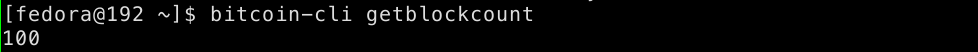
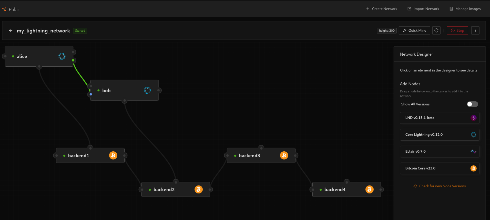
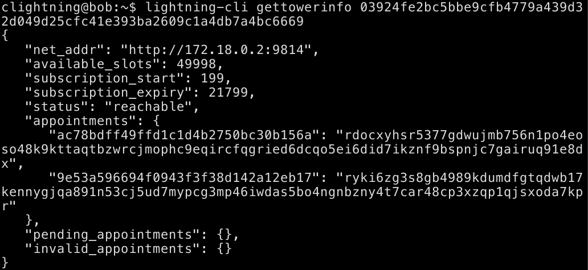
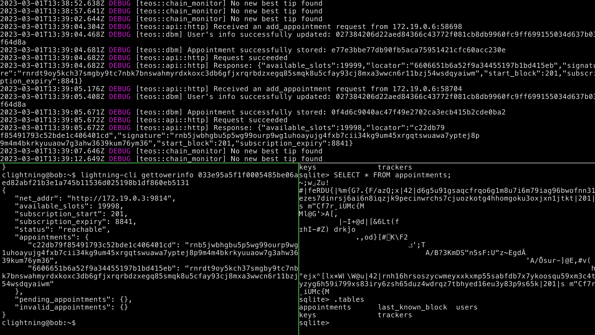
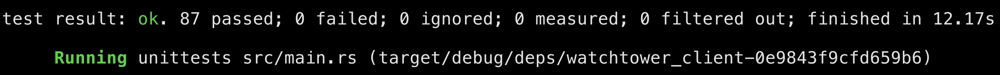
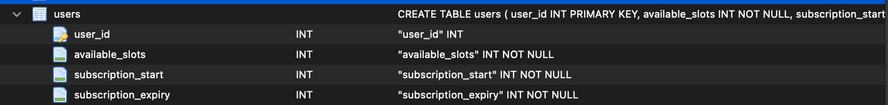
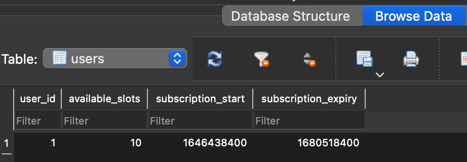
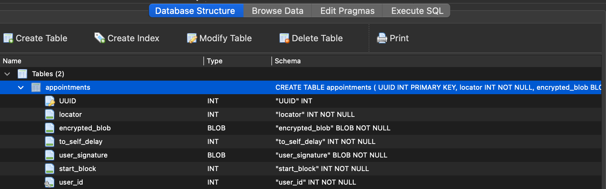
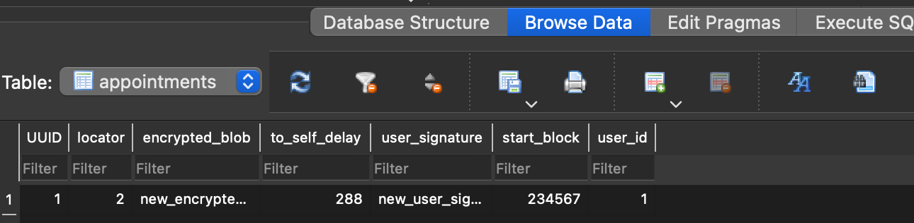

# Eye of Satoshi Summer of Bitcoin Competence Test 2023

## General Description

This repository contains the files created on completing the competence test of "Generalize rust-teos to support different SQL engines" Eye of Satoshi organization project in Summer of Bitcoin 2023.

Submitted by: Mohamed Awnallah <mohamedmohey2352@gmail.com> <br>
Operating System: Fedora 37 64bit <br>
Rust Compiler Version: rustc 1.67.1 (d5a82bbd2 2023-02-07) (Fedora 1.67.1-1.fc37) <br>
Cargo Package Manager Version: cargo 1.67.1 (8ecd4f20a 2023-01-10) <br>

## Description of the Competence Test
1.
```
Compile rust-teos and run the tower
```
The Process of compiling rust-teos and running the watchtower showing as in the following images:

Compiling and Installing Rust Teos <br>


Running Bitcoind<br>


Generate 100 blocks <br>


Running the tower <br>


Running the Polar Lightning network with 4 bitcoin cores and 2 Lightning nodes <br>


Registering tower in bob lightning node <br>


Creating invoice from Bob to Alice on Polar Lightning Network <br>


Getting approved appointmnets <br>


Teosd up and running all in one <br>


2.
```
Run the test suite
```

The following image shows that all test cases succeeded after running the following commnad:
```bash
cargo test
```



3.
```
Create a basic example of loading, storing, and updating data to the teos database
```
I've created a basic crud example for both `users` and `appointments` with fake data into `teos` sqlite3 database. the could be accessed in `scripts` directory


Populating Users table schema


Populating Users fake data


Populating Appointments table schema


Populating Appointments fake Data


## Instructions to build and run the simple script for loading, storing, updating data to teos-database:

### Prequisities
- [Rust](https://www.rust-lang.org/tools/install)

### Steps
- Clone this repository using the following commnad:
```
git clone https://github.com/mhmdawnallah/Generalize-rust-teos-to-support-different-SQL-engines-competence-test.git
```
- change current working directory to crud_users_appointments_to_teosdb using the following command:
```bash
cd scripts/crud_users_appointments_to_teosdb/src
```
- Run the following cargo command. This will generate `teos_db.sql3` sqlite3 database.
```bash
cargo run main.rs
```
- Run sqlite3 command against `teos_db.sql3` using sqlite3 utility in terminal:
```bash
sqlite3 teos_db.sql3
```
- Run the following command to lookup the current tables:
```sqlite3
.tables
```
- Select all users data in `users` table where user_id = 1:
```
SELECT * FROM users WHERE user_id = 1
```
- Select all appointments data in `appointments` table where user_id = 1;
```
SELECT * FROM users WHERE user_id = 1
```
## Additional Resources
This training video "Deploying an Eye of Satoshi Lightning Watchtower" helped me to configure Polar Lightning Network and integrate with watch tower. You could access it [here](https://www.youtube.com/watch?v=8vzNB_NZt2A&t=2194s)
