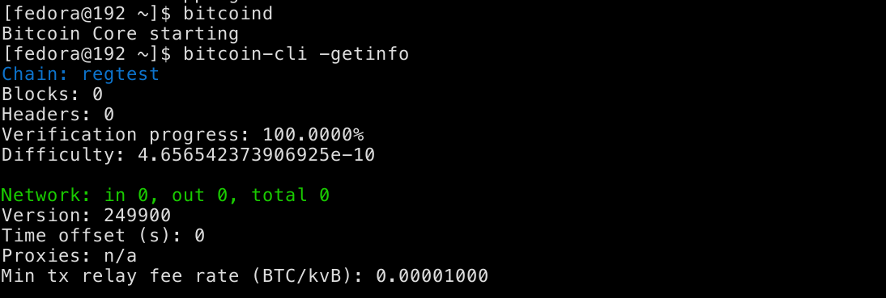
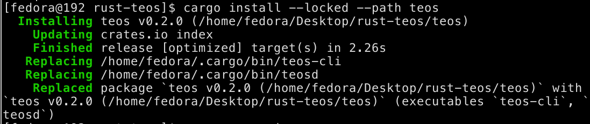
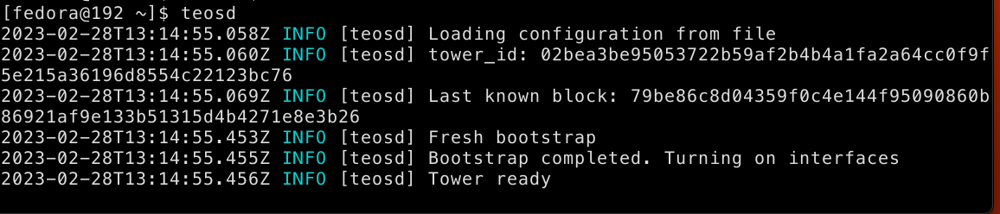

# Eye of Satoshi Summer of Bitcoin Competence Test 2023

## General Description

This repository contains the files created on completing the competence test of "Generalize rust-teos to support different SQL engines" Eye of Satoshi organization project in Summer of Bitcoin 2023.

Submitted by: Mohamed Awnallah <br>
Operating System: Fedora 37 64bit <br>
Rust Compiler Version: rustc 1.67.1 (d5a82bbd2 2023-02-07) (Fedora 1.67.1-1.fc37) <br>
Cargo Package Manager Version: cargo 1.67.1 (8ecd4f20a 2023-01-10) <br>

## Description of the Competence Test
1.
```
Compile rust-teos and run the tower
```
The both images after compiling rust-teos and running the tower could be found respectively using the following links [compiling-rust-teos](assets/compiling-rust-teos), [running-the-tower](assets/running-the-tower).

Running Bitcoind<br>


Compiling and Installing Rust Teos


Running the tower


MAKE SURE TO ADD commands you ran, where you get it from

2.
```
Run the test suite
```
The following image after running the test suite for rust-teos could be accessed here [run-the-test-suite](assets/run-the-test-suite)

Running the rust-teos test suite


3.
```
Create a basic example of loading, storing, and updating data to the teos database
```
The following images for loading, storing, and updating data to the teos database respectively [loading-data-to-teos-database](assets/loading-data-to-teos-database), [storing-data-to-teos-database](assets/storing-data-to-teos-database), and [updating-data-to-teos-database](assets/updatin-data-teos-database)

Loading data to teos database


Storing data to teos database


Updating data to teos database


TODO Add commands you run for this

## Instructions to build and run the simple script for loading, storing, updating data to teos-database:
- Clone this repository and go to the location of the cloned repo.
- Go to the scripts directory:
  ```
  cd scripts
  ```
- Run the bash script using the following command:
```
./scripts.sh
```
#TODO What are the observations

